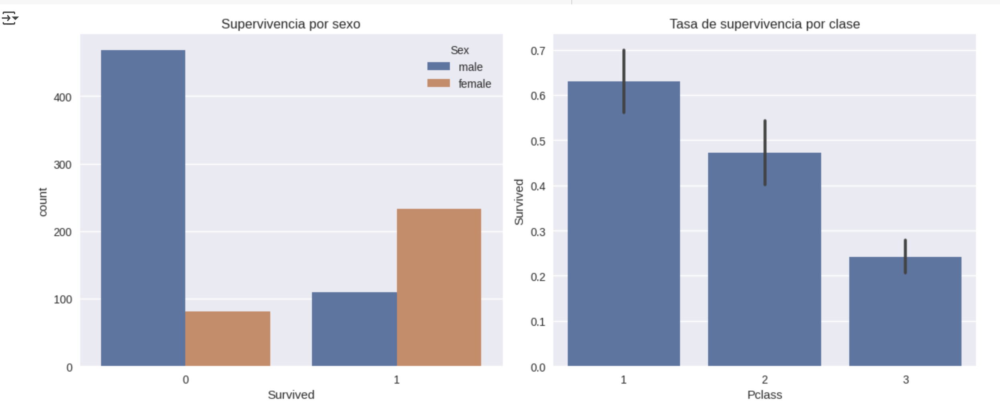

# Análisis Exploratorio de Datos (EDA) del Titanic 🚢

Como primera actividad, se nos presentó la idea de investigar sobre un datasaet muy famoso en la cienda de datos. 

## Contexto
El dataset del Titanic contiene ciertos datos de los pasajeros a bordo del barco, dividido en un conjunto de "entrenamiento" y otro de prueba. El objetivo del ejercicio de Kaggle es usar esta información para construir un modelo de Machine Learning que pueda predecir con precisión quiénes sobrevivieron al naufragio en el conjunto de prueba. Todo esto como un desafío de clasificación para familiarizarnos en el ciclo de vida de un proyecto de cienca de datos.

## Objetivos
**Inverstigar** sobre la estructura y significado de las variables del dataset
**Visualizar las relaciones** entre las variables importantes (sexo, edad, clase) y la supervivencia.

## Actividades
- Investigación y comprensión del dataset, las variables y el problema
- Configuración de Colab y conexión a Drive
- Carga de Datos
- Visualización de datos clave en patrones de supervivencia
- Documentación

  ### Tabla de actividades con tiempos

| Actividad           | Tiempo | Resultado esperado               |
|---------------------|:------:|----------------------------------|
| Investigación       |  30m   | entender la práctica             |
| Configuración       |  15m   | Notebook listo t drive           |
| Carga de datos      |  5m    | API kaggle, 'train' y 'test'     |
| Discución datos     |  20m   | gráficos y conclusiones en equipo|


## Desarrollo
El proceso se llevó a cabo en un notebook de Google Colab.

???+ info "Ver el desarrollo técnico paso a paso"

    ### 1. Configuración del Entorno
    El primer paso fue importar las librerías y configurar el entorno para guardar los resultados
    
    !!! tip "Google Drive"
        Configurar Google Drive en Colab permite persistir los datos, resultados y el propio notebook entre sesiones, evitando perder trabajo.

    ```python
    import pandas as pd
    import numpy as np
    import matplotlib.pyplot as plt
    import seaborn as sns
    from pathlib import Path

    # Google Drive para persistencia
    try:
        from google.colab import drive
        drive.mount('/content/drive')
        ROOT = Path('/content/drive/MyDrive/IA-UT1-Titanic')
    except Exception:
        ROOT = Path.cwd() / 'IA-UT1-Titanic'

    RESULTS_DIR = ROOT / 'results'
    RESULTS_DIR.mkdir(parents=True, exist_ok=True)
    print(f'Los resultados se guardarán en: {RESULTS_DIR}')
    ```
    ### 2. Cargar datos desde Kaggle
    Usamos la API de Kaggle para descargar el dataset directamente en el entorno de Colab.

    ```python linenums="1"
    # Configuración de la API de Kaggle
    !pip -q install kaggle
    from google.colab import files
    files.upload() # Subir el archivo kaggle.json
    !mkdir -p ~/.kaggle && cp kaggle.json ~/.kaggle/ && chmod 600 ~/.kaggle/kaggle.json

    # Descargar y descomprimir el dataset
    !kaggle competitions download -c titanic -p data
    !unzip -o data/titanic.zip -d data

    train_df = pd.read_csv('data/train.csv')
    test_df = pd.read_csv('data/test.csv')
    ```
    ### 3. Valores nulos
    Una vez cargados los datos, necesitaba saber en dónde podía encontrar valores nulos
    
    ```python
    print("Dimensiones del dataset de entrenamiento:", train_df.shape)
    train_df.info()

    # valores nulos
    print("\nValores nulos x columna:")
    print(train_df.isna().sum().sort_values(ascending=False))
    ```
    Este paso expuso que las columnas `Age`, `Cabin` y `Embarked` contienen valores faltantes


## Evidencias
El análisis visual a continuación dejó una representación clarísima sobre los patrones y factores de supervivencia.

![Panel de Visualizaciones del EDA del Titanic] (../assets/Titanic1.png){ width="700" }

Click para ampliar (lightbox):

[{ width="280" }](../assets/Titanic1.png)


![Panel de Visualizaciones del EDA del Titanic] (../assets/Titanic2.png){ width="700" }

**Hallazgos**

1.  **Sexo:** Las mujeres tuvieron una tasa de supervivencia bastante mayor que los hombres
2.  **Clase Socioeconómica (Pclass):** Los pasajeros de primera clase tuvieron la mayor tasa de supervivencia, mientras que los de tercera clase tuvieron la menor
3.  **Edad:** Los niños pequeños tenían una mayor probabilidad de sobrevivir
4.  **Correlaciones:** La matriz de correlación confirma la fuerte relación negativa entre `Pclass` y `Survived` (a menor número de clase, mayor supervivencia) y una relación positiva con `Fare`

## Reflexión

Este análisis fue de mucha ayuda para empezar a familiarizarme con el dataset y tambi´n entender un poco más de dónde salen las hipótesis a partir de un evento histórico


## Referencias
- [Página de la competencia del Titanic en Kaggle](https://www.kaggle.com/competitions/titanic)


